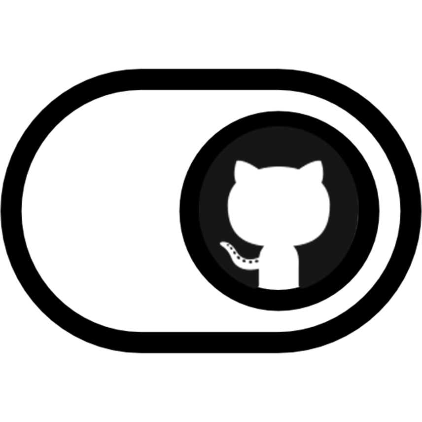

<p align="center"></p>
<h1 align="center">GitHub Dashboard Switch</h1>
<h4 align="center">New update of GitHub moved Dashboard to Left Hand side, do you miss the right hand side one?
No worries, it is just one toggle away.</h4>


<p align="center">


</p>


## In action :movie_camera:


## Installation

### Firefox Users:

[](https://addons.mozilla.org/en-US/firefox/addon/github-dashboard-fix/)

 - Download it from Store: https://addons.mozilla.org/en-US/firefox/addon/github-dashboard-fix/

   **OR**
   
   Check Firefox Development Branch [here](https://github.com/aashutoshrathi/GitHub-Dash-Aligner/tree/firefox)

 - **Please leave feedback and ratings** ✍️
 - To test it, go to [GitHub](https://www.github.com).
 - Switch Back to Right Hand Mode :rocket:.

### Chrome Users:

 - Get it locally -
   ```sh
   $ git clone https://github.com/aashutoshrathi/GitHub-Dash-Aligner.git
   ```

   **OR**

   Download the latest version here: [GitHub Dashboard Switch](https://github.com/aashutoshrathi/GitHub-Dash-Aligner/archive/master.zip)

 - Go to `chrome://extensions/`.
 - Click on Load Unpacked Extension and Open/Select the folder.


 - To test it, go to [GitHub](https://www.github.com).
 - Switch Back to Right Hand Mode :rocket:.


##### Note

If you can't find the button on the top of the page, make sure that Developer mode is enabled [here](https://developer.chrome.com/extensions/faq#faq-dev-01).


### Author

[Aashutosh Rathi](https://github.com/aashutoshrathi)

[](https://twitter.com/AashutoshRathi)
[](https://linkedin.com/in/aashutoshrathi)
[](https://www.facebook.com/aashutoshrathi)
[](https://www.paypal.me/AashutoshRathi)

<h4 align="center"> Made from scratch with ❤ by <a href="https://github.com/aashutoshrathi">Aashutosh Rathi</a></h4>

Icons used are created by [Freepik](https://www.flaticon.com/authors/freepik)
